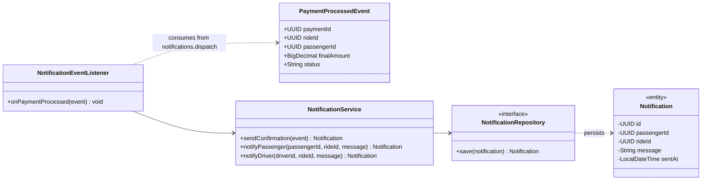

# Class Diagram - Notification Service

```mermaid
classDiagram
    direction LR

    class PaymentProcessedEvent {
        +UUID paymentId
        +UUID rideId
        +UUID passengerId
        +BigDecimal finalAmount
        +String status
    }

    class NotificationEventListener {
        +onPaymentProcessed(event) void
    }

    class NotificationService {
        +sendConfirmation(event) Notification
        +notifyPassenger(passengerId, rideId, message) Notification
        +notifyDriver(driverId, rideId, message) Notification
    }

    class NotificationRepository {
        <<interface>>
        +save(notification) Notification
    }

    class Notification {
        <<entity>>
        -UUID id
        -UUID passengerId
        -UUID rideId
        -String message
        -LocalDateTime sentAt
    }

    NotificationEventListener ..> PaymentProcessedEvent : consumes from notifications.dispatch
    NotificationEventListener --> NotificationService
    NotificationService --> NotificationRepository
    NotificationRepository ..> Notification : persists
```
