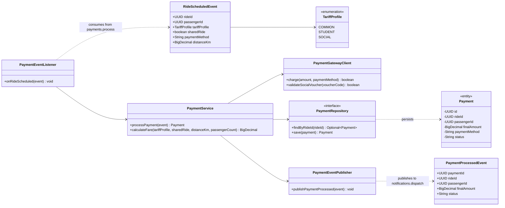

# Class Diagram - Payment Service

```mermaid
classDiagram
    direction LR

    class RideScheduledEvent {
        +UUID rideId
        +UUID passengerId
        +TariffProfile tariffProfile
        +boolean sharedRide
        +String paymentMethod
        +BigDecimal distanceKm
    }

    class TariffProfile {
        <<enumeration>>
        COMMON
        STUDENT
        SOCIAL
    }

    class PaymentEventListener {
        +onRideScheduled(event) void
    }

    class PaymentService {
        +processPayment(event) Payment
        +calculateFare(tariffProfile, sharedRide, distanceKm, passengerCount) BigDecimal
    }

    class PaymentGatewayClient {
        +charge(amount, paymentMethod) boolean
        +validateSocialVoucher(voucherCode) boolean
    }

    class PaymentRepository {
        <<interface>>
        +findByRideId(rideId) Optional~Payment~
        +save(payment) Payment
    }

    class PaymentEventPublisher {
        +publishPaymentProcessed(event) void
    }

    class Payment {
        <<entity>>
        -UUID id
        -UUID rideId
        -UUID passengerId
        -BigDecimal finalAmount
        -String paymentMethod
        -String status
    }

    class PaymentProcessedEvent {
        +UUID paymentId
        +UUID rideId
        +UUID passengerId
        +BigDecimal finalAmount
        +String status
    }

    RideScheduledEvent --> TariffProfile
    PaymentEventListener ..> RideScheduledEvent : consumes from payments.process
    PaymentEventListener --> PaymentService
    PaymentService --> PaymentGatewayClient
    PaymentService --> PaymentRepository
    PaymentService --> PaymentEventPublisher
    PaymentRepository ..> Payment : persists
    PaymentEventPublisher ..> PaymentProcessedEvent : publishes to notifications.dispatch
```
