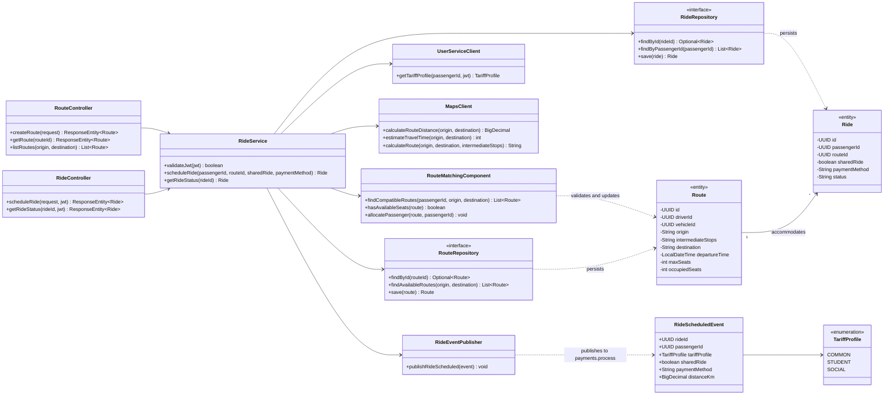

# Class Diagram - Route and Ride Service

```mermaid
classDiagram
    direction LR

    class RouteController {
        +createRoute(request) ResponseEntity~Route~
        +getRoute(routeId) ResponseEntity~Route~
        +listRoutes(origin, destination) List~Route~
    }

    class RideController {
        +scheduleRide(request, jwt) ResponseEntity~Ride~
        +getRideStatus(rideId, jwt) ResponseEntity~Ride~
    }

    class RideService {
        +validateJwt(jwt) boolean
        +scheduleRide(passengerId, routeId, sharedRide, paymentMethod) Ride
        +getRideStatus(rideId) Ride
    }

    class RouteMatchingComponent {
        +findCompatibleRoutes(passengerId, origin, destination) List~Route~
        +hasAvailableSeats(route) boolean
        +allocatePassenger(route, passengerId) void
    }

    class UserServiceClient {
        +getTariffProfile(passengerId, jwt) TariffProfile
    }

    class MapsClient {
        +calculateRouteDistance(origin, destination) BigDecimal
        +estimateTravelTime(origin, destination) int
        +calculateRoute(origin, destination, intermediateStops) String
    }

    class RideEventPublisher {
        +publishRideScheduled(event) void
    }

    class RouteRepository {
        <<interface>>
        +findById(routeId) Optional~Route~
        +findAvailableRoutes(origin, destination) List~Route~
        +save(route) Route
    }

    class RideRepository {
        <<interface>>
        +findById(rideId) Optional~Ride~
        +findByPassengerId(passengerId) List~Ride~
        +save(ride) Ride
    }

    class Route {
        <<entity>>
        -UUID id
        -UUID driverId
        -UUID vehicleId
        -String origin
        -String intermediateStops
        -String destination
        -LocalDateTime departureTime
        -int maxSeats
        -int occupiedSeats
    }

    class Ride {
        <<entity>>
        -UUID id
        -UUID passengerId
        -UUID routeId
        -boolean sharedRide
        -String paymentMethod
        -String status
    }

    class TariffProfile {
        <<enumeration>>
        COMMON
        STUDENT
        SOCIAL
    }

    class RideScheduledEvent {
        +UUID rideId
        +UUID passengerId
        +TariffProfile tariffProfile
        +boolean sharedRide
        +String paymentMethod
        +BigDecimal distanceKm
    }

    RouteController --> RideService
    RideController --> RideService
    RideService --> RouteMatchingComponent
    RideService --> UserServiceClient
    RideService --> MapsClient
    RideService --> RouteRepository
    RideService --> RideRepository
    RideService --> RideEventPublisher
    RouteMatchingComponent ..> Route : validates and updates
    RideRepository ..> Ride : persists
    RouteRepository ..> Route : persists
    RideEventPublisher ..> RideScheduledEvent : publishes to payments.process
    RideScheduledEvent --> TariffProfile
    Route "1" --> "*" Ride : accommodates
```
