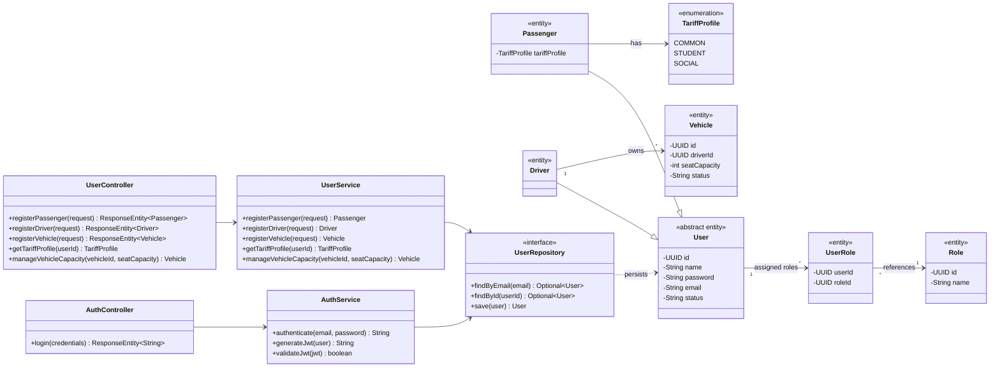

# Class Diagram - User Service

```mermaid
classDiagram
    direction LR

    class User {
        <<abstract entity>>
        -UUID id
        -String name
        -String password
        -String email
        -String status
    }

    class Passenger {
        <<entity>>
        -TariffProfile tariffProfile
    }

    class Driver {
        <<entity>>
    }

    class Role {
        <<entity>>
        -UUID id
        -String name
    }

    class UserRole {
        <<entity>>
        -UUID userId
        -UUID roleId
    }

    class TariffProfile {
        <<enumeration>>
        COMMON
        STUDENT
        SOCIAL
    }

    class Vehicle {
        <<entity>>
        -UUID id
        -UUID driverId
        -int seatCapacity
        -String status
    }

    class AuthController {
        +login(credentials) ResponseEntity~String~
    }

    class UserController {
        +registerPassenger(request) ResponseEntity~Passenger~
        +registerDriver(request) ResponseEntity~Driver~
        +registerVehicle(request) ResponseEntity~Vehicle~
        +getTariffProfile(userId) TariffProfile
        +manageVehicleCapacity(vehicleId, seatCapacity) Vehicle
    }

    class AuthService {
        +authenticate(email, password) String
        +generateJwt(user) String
        +validateJwt(jwt) boolean
    }

    class UserService {
        +registerPassenger(request) Passenger
        +registerDriver(request) Driver
        +registerVehicle(request) Vehicle
        +getTariffProfile(userId) TariffProfile
        +manageVehicleCapacity(vehicleId, seatCapacity) Vehicle
    }

    class UserRepository {
        <<interface>>
        +findByEmail(email) Optional~User~
        +findById(userId) Optional~User~
        +save(user) User
    }

    Passenger --|> User
    Driver --|> User
    User "1" --> "*" UserRole : assigned roles
    UserRole "*" --> "1" Role : references
    Passenger --> TariffProfile : has
    Driver "1" --> "*" Vehicle : owns

    AuthController --> AuthService
    AuthService --> UserRepository
    UserController --> UserService
    UserService --> UserRepository
    UserRepository ..> User : persists
```
